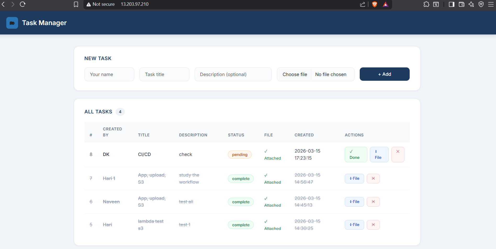
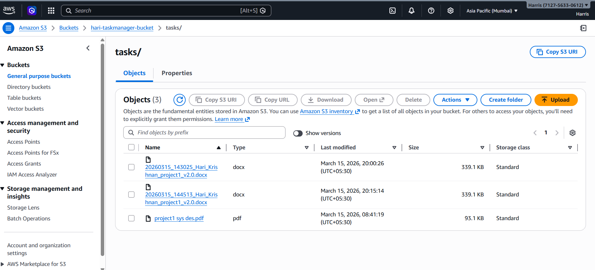
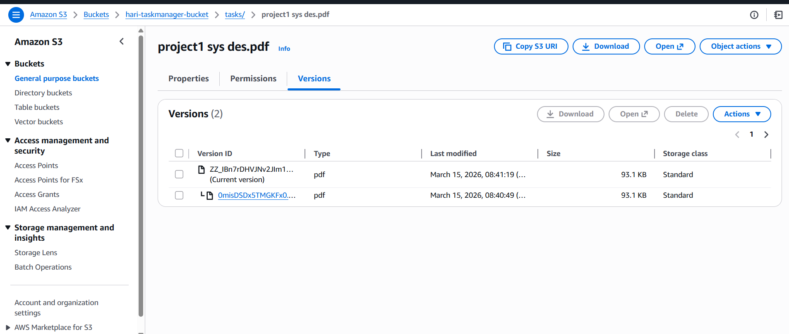
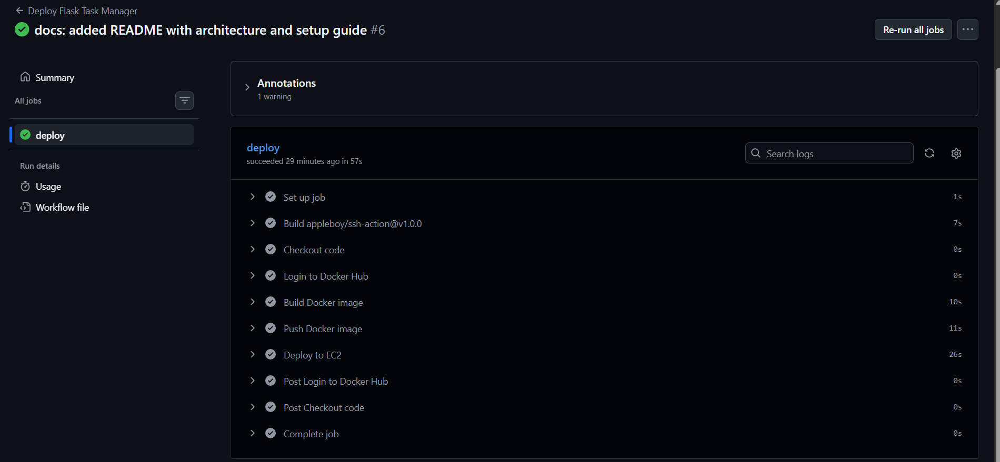
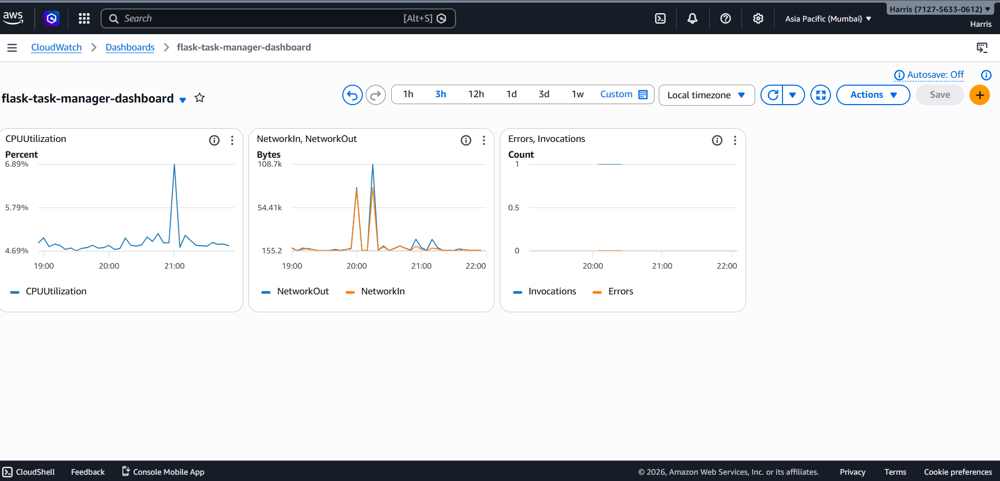
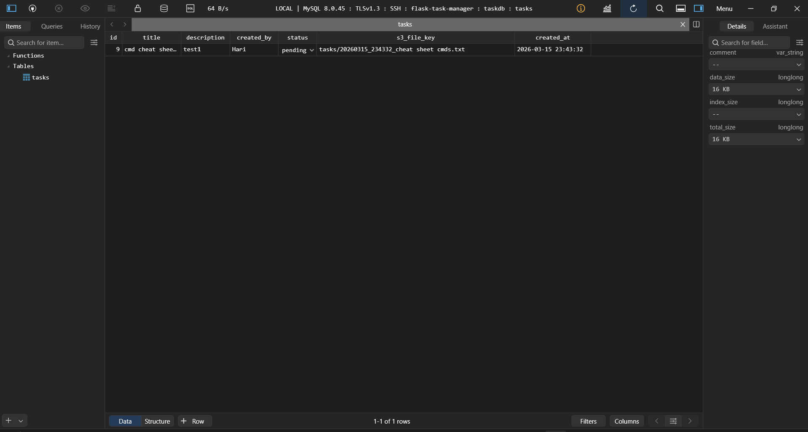

# 🗂️ Flask Task Manager — DevOps Project


A full-stack **Task Manager web application** built with Flask and deployed on AWS using DevOps best practices — Docker, CI/CD, serverless functions, cloud storage, and real-time monitoring.

> 🔗 **Live App:** http://13.203.97.210
> 📦 **Repo:** https://github.com/Harris08/flask-task-manager-devops

---

## 🏗️ Architecture

```
Developer
    │
    ├── git push
    │       │
    │       ▼
    │   GitHub Actions (CI/CD)
    │       │
    │       ├── Build Docker Image
    │       ├── Push to Docker Hub
    │       └── Deploy to EC2 via SSH
    │
    ▼
AWS EC2 (t2.micro) — Ubuntu 22.04
    │
    └── Docker Compose (app-network)
            │
            ├── Apache2 Container (Port 80) ← Reverse Proxy
            │       └── Proxy Pass → Flask
            │
            ├── Flask App Container (Port 5000)
            │       ├── Task CRUD operations
            │       ├── File upload → S3
            │       └── Presigned URL download
            │
            └── MySQL 8.0 Container (Port 3306)
                    └── taskdb database

AWS Services
    ├── S3 Bucket (hari-taskmanager-bucket)
    │       └── Stores uploaded files (tasks/ prefix)
    │
    ├── Lambda (task-file-processor)
    │       ├── Triggered by S3 PUT event
    │       └── Sends email via SES on upload
    │
    ├── SES (Simple Email Service)
    │       └── Email notifications on file upload
    │
    ├── CloudWatch
    │       └── Monitoring dashboard (CPU, Network, Lambda)
    │
    └── IAM
            └── Roles & policies for EC2, Lambda, S3, SES
```

---

## ✨ Features

- ✅ **Create tasks** with title, description, and file attachment
- ✅ **File upload** to AWS S3 with timestamp-based naming
- ✅ **Presigned URL download** — secure, time-limited file access
- ✅ **Mark tasks as complete** or delete them
- ✅ **Email notification** via AWS SES on every file upload
- ✅ **MySQL database** for persistent task storage
- ✅ **Responsive UI** built with Bootstrap 5

---

## 🛠️ Tech Stack

| Layer | Technology |
|---|---|
| **Backend** | Python 3.11, Flask |
| **Database** | MySQL 8.0 |
| **Frontend** | HTML, Bootstrap 5, Jinja2 |
| **Containerization** | Docker, Docker Compose |
| **Reverse Proxy** | Apache2 (httpd) |
| **Cloud Provider** | AWS (ap-south-1) |
| **File Storage** | AWS S3 |
| **Serverless** | AWS Lambda (Python 3.11) |
| **Email** | AWS SES |
| **Monitoring** | AWS CloudWatch |
| **CI/CD** | GitHub Actions |
| **DB Admin** | TablePlus (SSH Tunnel) |
| **IaC** | Docker Compose |

---

## 🚀 CI/CD Pipeline

```
git push → GitHub Actions triggered
               │
               ├── 1. Checkout code
               ├── 2. Build Docker image
               ├── 3. Push to Docker Hub
               └── 4. SSH into EC2
                       ├── docker-compose pull
                       ├── docker-compose down
                       └── docker-compose up -d
```

**Pipeline runs in ~48 seconds** ⚡

---

## ☁️ AWS Infrastructure

| Service | Purpose | Region |
|---|---|---|
| EC2 t2.micro | Application server | ap-south-1 |
| S3 Bucket | File attachments storage | ap-south-1 |
| Lambda | Serverless file processor | ap-south-1 |
| SES | Email notifications | ap-south-1 |
| CloudWatch | Monitoring & alerting | ap-south-1 |
| IAM | Access management | Global |

---

## 📊 CloudWatch Monitoring Dashboard

The `flask-task-manager-dashboard` monitors:
- **CPU Utilization** — EC2 instance performance
- **NetworkIn / NetworkOut** — Traffic monitoring
- **Lambda Invocations** — Serverless function calls
- **Lambda Errors** — Error rate tracking

---

## 🗄️ Database Schema

```sql
CREATE TABLE tasks (
    id          INT AUTO_INCREMENT PRIMARY KEY,
    title       VARCHAR(255) NOT NULL,
    description TEXT,
    created_by  VARCHAR(100),
    status      ENUM('pending', 'complete') DEFAULT 'pending',
    s3_file_key VARCHAR(500),
    created_at  TIMESTAMP DEFAULT CURRENT_TIMESTAMP
);
```

---

## ⚙️ Local Setup

### Prerequisites
- Docker & Docker Compose
- AWS Account with S3, SES, Lambda configured
- AWS credentials

### 1. Clone the repo
```bash
git clone https://github.com/Harris08/flask-task-manager-devops.git
cd flask-task-manager-devops
```

### 2. Configure environment
```bash
cp .env.example .env
# Edit .env with your values
```

```env
MYSQL_HOST=mysql
MYSQL_USER=root
MYSQL_PASSWORD=your_password
MYSQL_DATABASE=taskdb
AWS_ACCESS_KEY_ID=your_key
AWS_SECRET_ACCESS_KEY=your_secret
AWS_S3_BUCKET=your_bucket
AWS_REGION=ap-south-1
SES_FROM_EMAIL=your_email@gmail.com
SES_TO_EMAIL=your_email@gmail.com
```

### 3. Run with Docker Compose
```bash
docker-compose up -d
```

### 4. Access the app
```
http://localhost
```

---

## 🔐 Security Notes

- MySQL is **not exposed** to the public internet (internal Docker network only)
- S3 bucket is **private** — files accessed via presigned URLs only
- AWS credentials stored as **GitHub Secrets** (never hardcoded)
- TablePlus connects via **SSH tunnel** — no direct DB exposure

---

## 📁 Project Structure

```
flask-task-manager-devops/
├── app/
│   ├── app.py              # Flask application
│   ├── templates/
│   │   └── index.html      # Frontend UI
│   └── init.sql            # Database initialization
├── apache2/
│   └── httpd.conf          # Apache reverse proxy config
├── lambda/
│   └── lambda_function.py  # AWS Lambda function
├── .github/
│   └── workflows/
│       └── deploy.yml      # GitHub Actions CI/CD
├── docker-compose.yml      # Container orchestration
├── Dockerfile              # Flask app container
├── requirements.txt        # Python dependencies
└── .env.example            # Environment template
```

---

## 👨‍💻 Author

**Hari Krishnan**
- GitHub: [@Harris08](https://github.com/Harris08)
- Project: Flask Task Manager DevOps

---

## 📸 Screenshots

### Task Manager UI


### S3 Bucket — File Storage


### S3 Versioning


### GitHub Actions CI/CD Pipeline


### CloudWatch Monitoring Dashboard


### TablePlus — Database View


---

*Built as a DevOps portfolio project demonstrating end-to-end cloud deployment, containerization, CI/CD automation, and AWS managed services.*# flask-task-manager-devops
Flask Task Manager with S3, Lambda, Apache2, Docker, GitHub Actions CI/CD — AWS DevOps Portfolio Project
